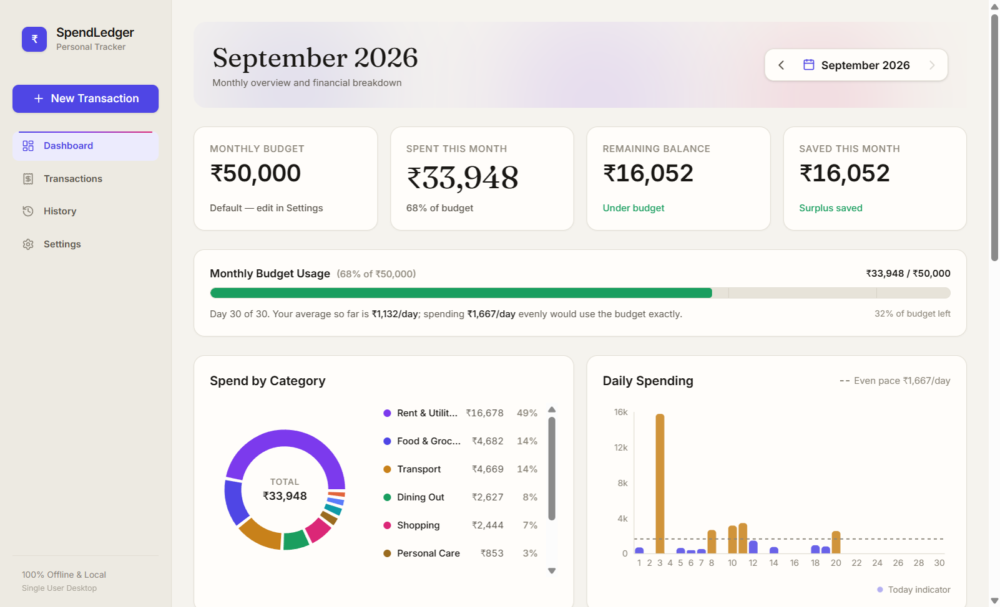
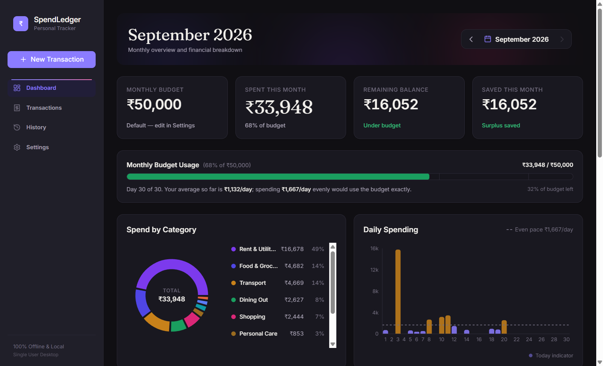
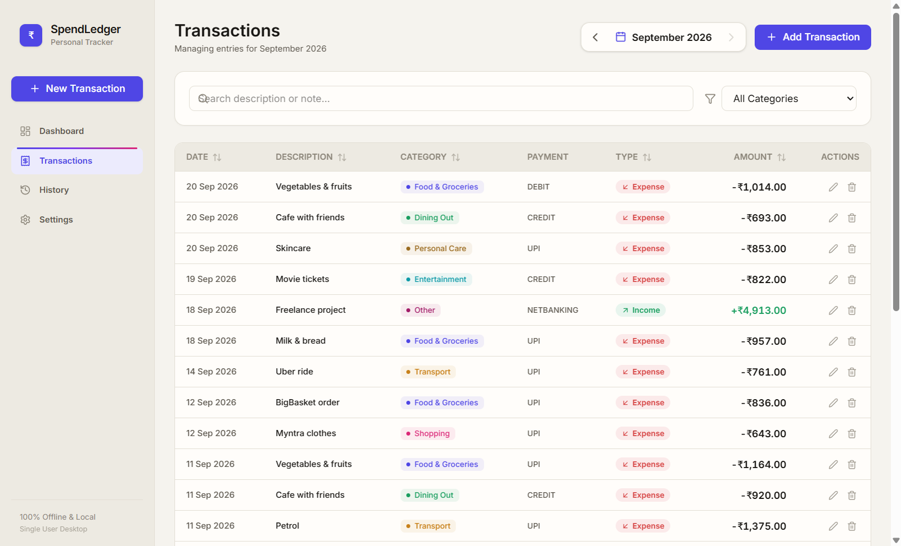
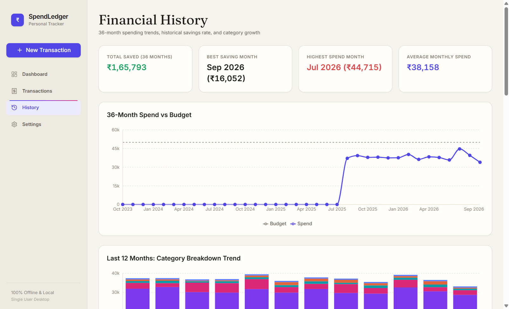
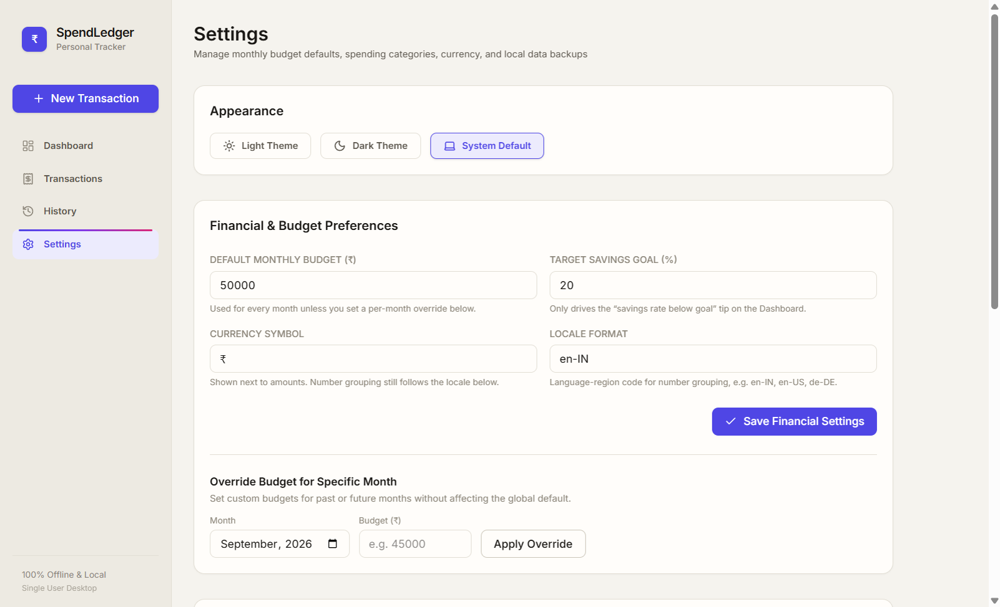

<div align="center">


# SpendLedger

**A private, offline desktop app for tracking your monthly income, expenses and budget.**

No accounts. No cloud. No tracking. Your money data never leaves your computer.




</div>

---

## Table of Contents

- [About](#about)
- [Features](#features)
- [Screenshots](#screenshots)
- [Tech Stack](#tech-stack)
- [Installation Guide](#installation-guide)
  - [Prerequisites](#1-prerequisites)
  - [Clone the repository](#2-clone-the-repository)
  - [Install dependencies](#3-install-dependencies)
  - [Run the app in development mode](#4-run-the-app-in-development-mode)
  - [Run a production build locally](#5-run-a-production-build-locally)
  - [Build a Windows installer](#6-build-a-windows-installer-optional)
  - [One-click desktop launcher](#7-one-click-desktop-launcher-windows-optional)
- [Available Scripts](#available-scripts)
- [Running Tests](#running-tests)
- [Project Structure](#project-structure)
- [Architecture](#architecture)
- [Data Storage, Backups & Recovery](#data-storage-backups--recovery)
- [Privacy & Security](#privacy--security)
- [Troubleshooting](#troubleshooting)
- [Contributing](#contributing)
- [Roadmap & Known Limitations](#roadmap--known-limitations)
- [License](#license)
- [Author](#author)

---

## About

SpendLedger is a personal finance tracker for people who want to know where their money goes each month without handing their bank history to a third-party service. You log income and expenses, set a monthly budget, and SpendLedger shows how you're doing: budget usage, category breakdowns, daily spending, long-term trends, and practical suggestions for saving money.

Everything is stored in a single JSON file on your own machine. The app never makes network requests. Its Content Security Policy blocks all outbound connections.

---

## Features

### Dashboard
- **Monthly overview cards:** budget, amount spent, remaining balance and amount saved, with animated counters.
- **Budget usage meter:** colour-coded (green → amber → red) with 70% / 90% / 100% markers and a daily pace note (*"your average so far is ₹X/day; spending ₹Y/day would use the budget exactly"*).
- **Spend by Category:** interactive donut chart with a per-category legend and percentages.
- **Daily Spending:** bar chart for every day of the month, with an "even pace" reference line.
- **Smart savings suggestions:** 12 built-in rules that look at your real numbers, for example:
  - over budget / on pace to overspend
  - one category taking more than 35% of spending
  - discretionary spending above 30%
  - a category spiking more than 25% above its 3-month average
  - recurring payments and subscriptions detected automatically
  - many small, frequent purchases adding up
  - savings rate below your goal
  - weekend-heavy spending
  - on-track and idle-surplus encouragement
- **Month picker** to browse any past month.

### Transactions
- Add, edit and delete income or expense entries (amount, date, category, description, payment method, note).
- Payment methods: Cash, UPI, Debit card, Credit card, Net banking, Other.
- Search by description or note, filter by category, sort by any column.
- Form validation with clear error messages (powered by Zod).

### History
- **36-month Spend vs Budget** trend line.
- **Last 12 months category breakdown** as stacked bars.
- Summary stats: total saved, best saving month, highest spend month, average monthly spend.

### Settings
- **Appearance:** Light, Dark or System theme.
- **Financial preferences:** default monthly budget, savings goal %, currency symbol and locale (e.g. `en-IN`, `en-US`, `de-DE`).
- **Per-month budget overrides** for months that are different from usual.
- **Categories:** rename, recolour, mark as discretionary or essential, or add new ones (12 sensible defaults included).
- **Data & local storage:** export a JSON backup, import a backup, export transactions to CSV (Excel / Google Sheets), and open the data folder.

### Design
- A calm "Warm Ledger" design: warm paper tones, a single indigo accent, subtle grain texture, and motion that respects the OS **reduced-motion** setting. See [`DESIGN.md`](DESIGN.md) for the full design system.

---

## Screenshots

> The screenshots use made-up sample data.

| Dashboard (light) | Dashboard (dark) |
| :---: | :---: |
|  |  |
| **Transactions** | **History** |
|  |  |
| **Settings** | |
|  | |

---

## Tech Stack

| Layer | Technology |
| --- | --- |
| Desktop shell | [Electron 38](https://www.electronjs.org/) |
| Build tooling | [electron-vite 4](https://electron-vite.org/), [Vite 7](https://vite.dev/) |
| UI | [React 19](https://react.dev/), [TypeScript 5.9](https://www.typescriptlang.org/) |
| Styling | [Tailwind CSS 4](https://tailwindcss.com/) + CSS design tokens |
| State | [Zustand 5](https://zustand.docs.pmnd.rs/) |
| Charts | [Recharts 3](https://recharts.org/) |
| Animation | [Motion 12](https://motion.dev/) |
| Validation | [Zod 3](https://zod.dev/) |
| Dates | [date-fns 4](https://date-fns.org/) |
| Icons | [Lucide](https://lucide.dev/) |
| Testing | [Vitest 3](https://vitest.dev/) |
| Packaging | [electron-builder 26](https://www.electron.build/) (NSIS installer) |

---

## Installation Guide

Follow these steps to run SpendLedger on your own PC.

### 1. Prerequisites

Install these first:

| Tool | Version | Download |
| --- | --- | --- |
| **Git** | any recent version | https://git-scm.com/downloads |
| **Node.js** | **20 LTS or newer** (tested on Node 24) | https://nodejs.org/ |
| **npm** | comes with Node.js (tested on npm 11) | — |

**Supported OS:** Windows 10 / 11 is the main target, and the only platform with an installer. Development mode (`npm run dev`) also works on macOS and Linux.

Check your versions in a terminal (PowerShell, Command Prompt, Git Bash or any macOS/Linux terminal):

```bash
git --version
node -v
npm -v
```

If `node -v` prints something lower than `v20`, update Node.js before continuing.

### 2. Clone the repository

```bash
git clone https://github.com/shreyashk07004/Transactions-Tracker-.git
cd Transactions-Tracker-
```

> No Git? On the GitHub page click **Code → Download ZIP**, extract it, and open a terminal inside the extracted folder.

### 3. Install dependencies

```bash
npm install
```

This installs all packages and downloads the Electron binary (~100 MB), so the first run can take a few minutes.

### 4. Run the app in development mode

```bash
npm run dev
```

The SpendLedger window opens with **hot reload**: save any file under `src/` and the app updates instantly. Press `Ctrl + C` in the terminal to stop it.

### 5. Run a production build locally

Build optimised bundles into `out/` and start Electron from them:

```bash
npm run rebuild
npm start
```

To run the full check first (typecheck + tests + build):

```bash
npm run build
npm start
```

### 6. Build a Windows installer (optional)

```bash
npm run build:win
```

The installer is written to:

```
dist\SpendLedger-Setup-1.0.0.exe
```

Run it to install SpendLedger like any other Windows app. It lets you pick the install folder and creates Desktop and Start Menu shortcuts. You can also copy the `.exe` to another PC and install it there. No Node.js is needed on that PC.

> Windows SmartScreen may warn about an "unrecognised app" because the installer is not code-signed. Click **More info → Run anyway**.

### 7. One-click desktop launcher (Windows, optional)

If you'd rather run SpendLedger from source without building an installer:

1. Double-click **`Create Desktop Shortcut.bat`** in the project folder. A **SpendLedger** icon appears on your Desktop.
2. Double-click that icon (or **`Launch SpendLedger.bat`**) any time. It rebuilds the latest code (~10–30 s) and then opens the app.

If you move the project folder, run `Create Desktop Shortcut.bat` again to update the shortcut. Your data is not affected because it lives in `%APPDATA%\SpendLedger`, not in the project folder.

---

## Available Scripts

| Command | What it does |
| --- | --- |
| `npm run dev` | Start the app in development mode with hot reload |
| `npm run rebuild` | Build the main, preload and renderer bundles into `out/` |
| `npm start` | Launch Electron using the built files in `out/` |
| `npm run typecheck` | Type-check the main/preload (Node) and renderer (web) code |
| `npm test` | Run the unit test suite once with Vitest |
| `npm run build` | Typecheck + test + build (the full CI-style check) |
| `npm run build:win` | Full build, then package a Windows x64 NSIS installer into `dist/` |

---

## Running Tests

```bash
npm test            # run all unit tests
npm run typecheck   # strict TypeScript checks
```

The test suite (in `tests/`) covers the core logic:

| File | Covers |
| --- | --- |
| `tests/calc.test.ts` | Monthly totals, category breakdowns, budget calculations |
| `tests/suggestions.test.ts` | Every savings-suggestion rule |
| `tests/retention.test.ts` | 36-month retention and yearly archiving |

---

## Project Structure

```
Transactions-Tracker-/
├── build/                      # App icons used by the window and the installer
├── docs/screenshots/           # README screenshots
├── src/
│   ├── main/                   # Electron main process (Node.js)
│   │   ├── index.ts            #   Window creation, CSP, navigation lock-down
│   │   ├── ipc.ts              #   IPC handlers: load/save, backup, CSV, import
│   │   ├── storage.ts          #   Atomic, debounced reads/writes of data.json
│   │   ├── backup.ts           #   Rolling backups + latest-valid-backup recovery
│   │   └── retention.ts        #   36-month retention and yearly archives
│   ├── preload/
│   │   ├── index.ts            # Exposes a small, typed `window.api` bridge
│   │   └── api.d.ts            # Type definitions for `window.api`
│   └── renderer/               # React UI
│       ├── index.html
│       └── src/
│           ├── App.tsx         #   Root component and page routing
│           ├── pages/          #   Dashboard, Transactions, History, Settings
│           ├── components/     #   Charts, meter, table, form, dialogs, toasts…
│           ├── lib/            #   calc, suggestions, schema (Zod), format, categories
│           ├── store/          #   Zustand app store
│           ├── motion/         #   Animation tokens, variants, reduced-motion hook
│           ├── styles/         #   Tailwind entry, design tokens, fonts
│           └── types/          #   Shared data models
├── tests/                      # Vitest unit tests
├── Launch SpendLedger.bat      # Windows: rebuild + launch from source
├── Create Desktop Shortcut.bat # Windows: create a Desktop icon for the launcher
├── electron.vite.config.ts     # electron-vite build config
├── electron-builder.yml        # Installer config
├── DESIGN.md                   # Design system documentation
└── package.json
```

---

## Architecture

SpendLedger follows Electron's recommended **secure, three-layer** design:

```
┌──────────────────────────┐   window.api (contextBridge)   ┌──────────────────────────┐
│  Renderer (React UI)     │ ─────────────────────────────▶ │  Preload (sandboxed)     │
│  pages, charts, store    │                                │  typed IPC bridge        │
└──────────────────────────┘                                └────────────┬─────────────┘
                                                                         │ ipcRenderer.invoke
                                                                         ▼
                                                            ┌──────────────────────────┐
                                                            │  Main process (Node.js)  │
                                                            │  storage · backup ·      │
                                                            │  retention · dialogs     │
                                                            └────────────┬─────────────┘
                                                                         ▼
                                                            %APPDATA%\SpendLedger\data.json
```

- The **renderer** has no Node.js access. It talks to the main process only through `window.api`.
- IPC channels: `storage:load`, `storage:save`, `storage:openFolder`, `backup:export`, `backup:exportCsv`, `backup:import`, `app:getVersion`.
- All data (on load and on import) is validated against a **Zod schema** before it is used.

---

## Data Storage, Backups & Recovery

| What | Where (Windows) |
| --- | --- |
| Your ledger | `%APPDATA%\SpendLedger\data.json` |
| Automatic backups | `%APPDATA%\SpendLedger\backups\` (latest 10 kept) |
| Archived old records | `%APPDATA%\SpendLedger\archive\<year>.json` |

Tip: paste `%APPDATA%\SpendLedger` into the File Explorer address bar, or click **Settings → Open Data Folder**.

**How your data is protected:**
- **Atomic writes:** every save writes a temp file, flushes it to disk, then renames it over the old file, so a crash or power cut can't leave a half-written ledger.
- **Debounced saving:** rapid edits are grouped into a single write (300 ms).
- **Rolling backups:** a backup is taken automatically every time the app starts.
- **Automatic recovery:** if `data.json` is ever corrupted, it is kept as `data.corrupt-<timestamp>.json`, the latest valid backup is restored, and you get a notice.
- **36-month retention:** transactions older than 36 months are moved out of the main file into yearly archive files, so the app stays fast. They are never deleted.

**Manual backup & export:**
- **Settings → Export Backup (.json):** save a full copy anywhere (USB drive, cloud folder, etc.).
- **Settings → Export CSV:** open your transactions in Excel or Google Sheets.
- **Settings → Import Backup:** restore from any SpendLedger `.json` backup.

**Moving to a new PC:**
1. On the old PC: **Settings → Export Backup (.json)** and copy the file to a USB drive.
2. On the new PC: install SpendLedger (see the [Installation Guide](#installation-guide)).
3. Open **Settings → Import Backup** and select the file. All transactions, categories and budgets are restored.

---

## Privacy & Security

- **100% offline:** the Content Security Policy sets `connect-src 'none'`, so the app can't send data anywhere.
- **No accounts, telemetry or analytics.**
- **Hardened Electron setup:** `sandbox: true`, `contextIsolation: true`, `nodeIntegration: false`, new windows blocked, and navigation away from the app prevented.
- **Validated input:** every file read from disk or imported is checked against a strict schema.

---

## Troubleshooting

| Problem | Fix |
| --- | --- |
| `npm install` fails or hangs while downloading Electron | Check your internet/proxy, then run `npm cache clean --force`, delete `node_modules` and run `npm install` again. |
| `'node' is not recognized…` | Node.js isn't installed or isn't on your PATH. Install it from nodejs.org and reopen the terminal. |
| Errors about unsupported syntax / engine | Your Node.js is too old. Upgrade to Node 20 LTS or newer. |
| The app shows old code after you edit files | Run `npm run rebuild` before `npm start`, or use `npm run dev`. |
| `Launch SpendLedger.bat` shows **BUILD FAILED** | Read the error above it. It points at the file and line to fix. `npm run typecheck` gives more detail. |
| Data looks wrong after a crash | The app recovers automatically on the next start. You can also use **Settings → Import Backup** with a file from `%APPDATA%\SpendLedger\backups\`. |
| Want to start fresh | Export a backup first, close the app, then delete `%APPDATA%\SpendLedger\data.json`. A fresh ledger is created on the next launch. |
| SmartScreen blocks the installer | The installer isn't code-signed. Click **More info → Run anyway**. |

---

## Contributing

Contributions, bug reports and ideas are welcome.

1. Fork the repository.
2. Create a feature branch: `git checkout -b feature/my-improvement`
3. Make your changes and make sure everything passes:
   ```bash
   npm run build
   ```
4. Commit with a clear message and push: `git push origin feature/my-improvement`
5. Open a Pull Request describing what you changed and why.

Please follow the existing code style and the design rules in [`DESIGN.md`](DESIGN.md).

---

## Roadmap & Known Limitations

- The packaged installer is **Windows-only** for now (macOS/Linux work in dev mode).
- Defaults are set for India (₹, `en-IN`). You can change the currency symbol and locale in Settings.
- Single user, single device. There is no built-in sync (use JSON export/import to move data).
- Possible future work: recurring transaction templates, multi-currency support, charts export, macOS/Linux installers.

---

## License

This project is licensed under the **MIT License**. See the [LICENSE](LICENSE) file for details.

---

## Author

**[@shreyashk07004](https://github.com/shreyashk07004)**

If you find SpendLedger useful, consider giving the repository a ⭐ on GitHub.
